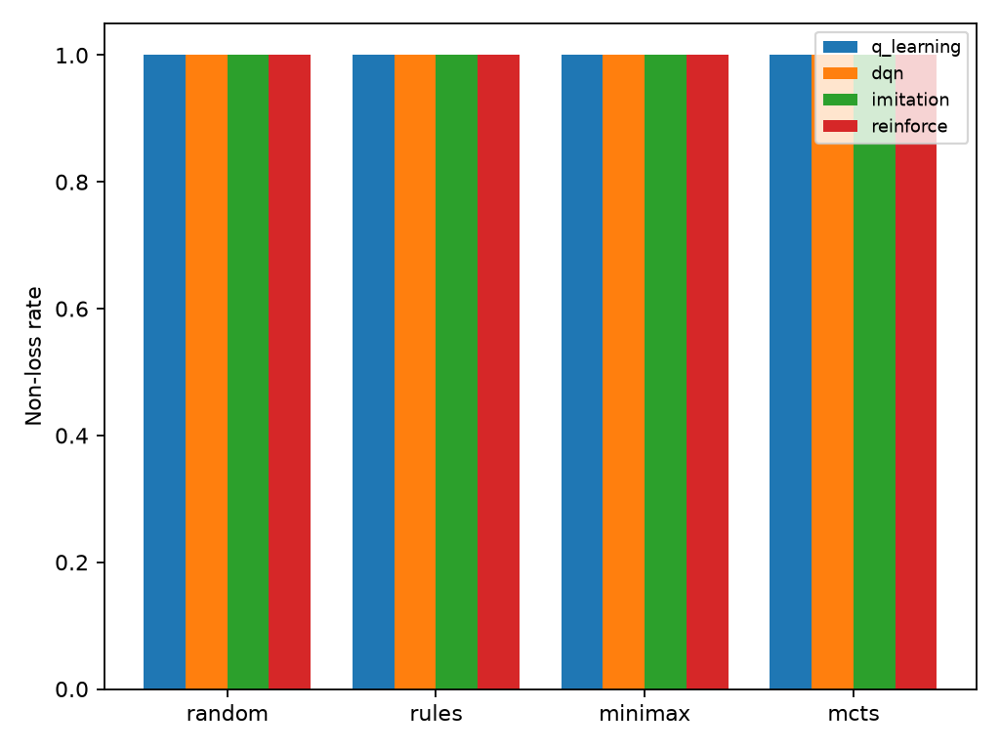

# Model benchmark

The table shows wins/draws/losses and the non-loss rate. Every candidate alternates between X and O.

| Model | Opponent | Games | W / D / L | Non-loss |
| --- | --- | ---: | ---: | ---: |
| q_learning | random | 1000 | 853 / 147 / 0 | 100.0% |
| q_learning | rules | 1000 | 16 / 984 / 0 | 100.0% |
| q_learning | minimax | 200 | 4 / 196 / 0 | 100.0% |
| q_learning | mcts | 200 | 12 / 188 / 0 | 100.0% |
| dqn | random | 500 | 456 / 44 / 0 | 100.0% |
| dqn | rules | 500 | 0 / 500 / 0 | 100.0% |
| dqn | minimax | 100 | 0 / 100 / 0 | 100.0% |
| dqn | mcts | 100 | 0 / 100 / 0 | 100.0% |
| imitation | random | 500 | 458 / 42 / 0 | 100.0% |
| imitation | rules | 500 | 0 / 500 / 0 | 100.0% |
| imitation | minimax | 100 | 2 / 98 / 0 | 100.0% |
| imitation | mcts | 100 | 11 / 89 / 0 | 100.0% |
| reinforce | random | 1000 | 927 / 73 / 0 | 100.0% |
| reinforce | rules | 1000 | 0 / 1000 / 0 | 100.0% |
| reinforce | minimax | 200 | 0 / 200 / 0 | 100.0% |
| reinforce | mcts | 200 | 0 / 200 / 0 | 100.0% |

Promotion requires no illegal moves, at least 99% non-loss against Random, and at least 95% against Rules.
The files under `models/` are the promoted runtime artifacts; training runs and checkpoints are not versioned.

